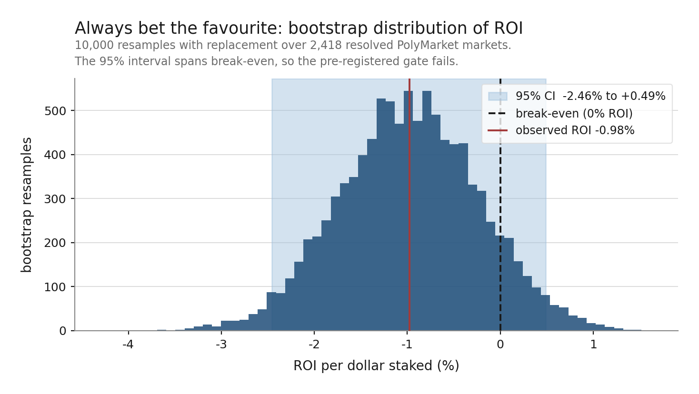
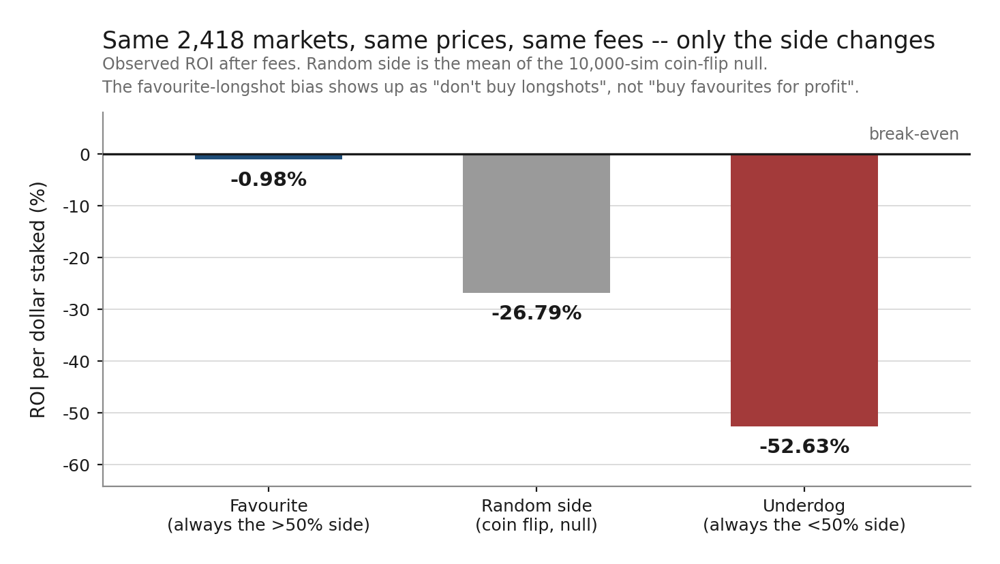

# PolyMarket Favourite-Bias Backtest

Does always betting the market favourite (>50% implied probability) on PolyMarket's resolved binary Yes/No markets beat the platform's costs? Backtested on **2,418** resolved markets ($100k+ volume, April 2023 – January 2025): favourites win **90.6%** of the time but the strategy still loses **0.98%** per dollar staked after fees (bootstrap 95% CI: **−2.46% to +0.49%**). The pre-registered gate (CI lower bound > 0% after fees, and the edge not concentrated in one category/time window) is **NOT PROVEN**. The mirror-image strategy — always betting the underdog on the same 2,418 markets — is far worse, losing **52.63%** per dollar staked (also **NOT PROVEN**, but nowhere near close): favourite **−0.98%** vs. random-side **−26.8%** vs. underdog **−52.63%**, meaning the bias PolyMarket shows up as "don't buy longshots," not "buy favourites for profit." Full methodology, exclusion accounting, and honest verdict in **[WRITEUP.md](WRITEUP.md)**.





Both charts are rendered from the committed results by `python scripts/plot_results.py` — the distribution above is the study's own 10,000 bootstrap resamples, recomputed at the same seed, not a curve fitted to the summary numbers.

This is a research backtest for a portfolio piece, not a live trading system — no execution layer, no real bets.

## Quick start

```bash
pip install -r requirements.txt
python -m pytest                          # 78 tests, no network
python run_backtest.py                    # -> results/results.json, exclusions.csv, crossval_report.json
python run_mc.py                          # -> results/mc_results.json (bootstrap, null, concentration, gate)
python run_underdog.py                    # mirror study -> results/mc_results_underdog.json
python scripts/dump_load_exclusions.py    # -> results/load_exclusions.csv (metadata-load exclusion breakdown)
python scripts/plot_results.py            # -> charts/*.png (reads committed results, no network)
```

`run_backtest.py` hits live PolyMarket Gamma + CLOB APIs and disk-caches every response under `cache/` (gitignored) — re-runs are instant. `results/` is regenerated output, but the JSON and CSV files are **committed on purpose**: every number in the writeup can be checked, and the charts rebuilt, without re-running the pipeline against a live API whose history may since have moved. Only `results/*.log` is gitignored.

## Project structure

```
polymarket-favourite-bias/
├── data/               # Gamma/CLOB API client, metadata loader, cross-validation
│   ├── api_client.py
│   ├── dataset_loader.py
│   ├── crossval.py
│   └── schema.py
├── backtest/           # favourite labeling, snapshot selection, fee model, payout engine
│   ├── favourite.py
│   ├── snapshot.py
│   ├── fees.py
│   ├── mirror.py
│   └── engine.py
├── mc/                 # bootstrap, random-side null, leave-one-group-out concentration check
│   ├── bootstrap.py
│   ├── reshuffle.py
│   ├── concentration.py
│   └── metrics.py
├── scripts/
│   ├── dump_load_exclusions.py   # persists metadata-load exclusion breakdown to disk
│   └── plot_results.py           # renders charts/ from the committed results
├── docs/specs/          # pre-registered design spec, dated and committed before any result existed
├── tests/               # pytest unit + integration tests
├── results/             # results.json, mc_results.json, crossval_report.json, *.csv (generated, committed)
├── charts/              # bootstrap_roi.png, strategy_comparison.png (generated, committed)
├── run_backtest.py       # end-to-end pipeline: load metadata -> filter -> simulate bets
├── run_mc.py              # Monte Carlo validation + pre-registered gate verdict
├── run_underdog.py        # mirror study: same markets, opposite side
├── requirements.txt
├── README.md
└── WRITEUP.md            # full methodology, results, honest verdict
```

See **[WRITEUP.md](WRITEUP.md)** for the question, method, data-quality notes, results, verdict, limitations, and future work. The significance gate it is judged against was fixed in advance in **[docs/specs/2026-07-14-polymarket-favourite-bias.md](docs/specs/2026-07-14-polymarket-favourite-bias.md)** §6 — committed before any result existed, so the verdict could not be moved to fit the number.
